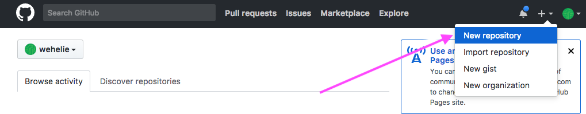
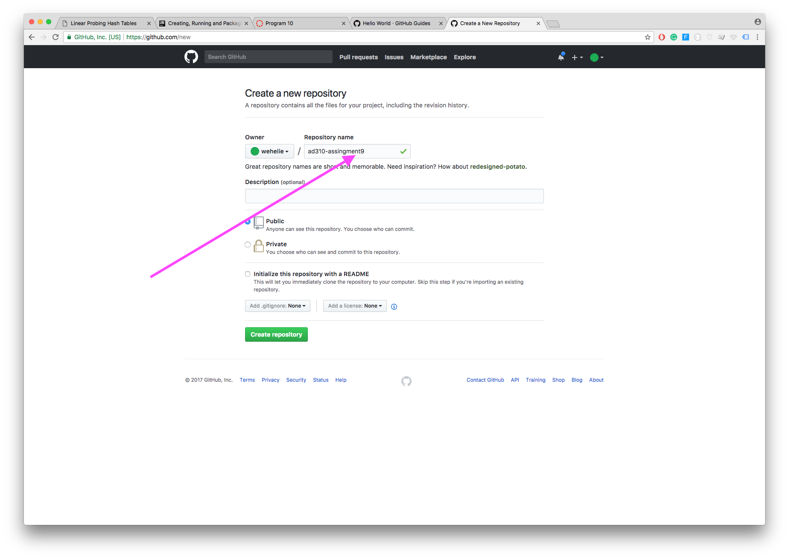
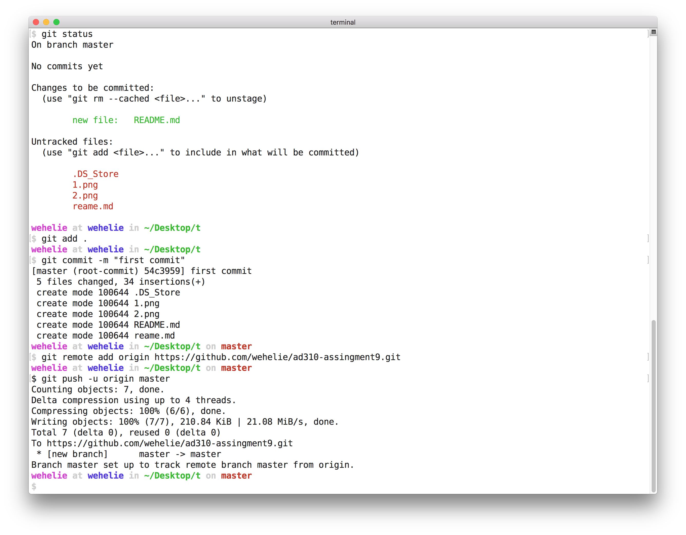
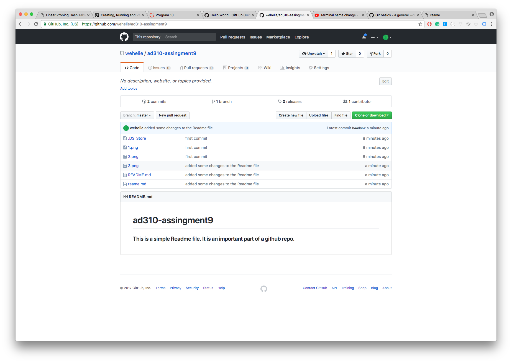
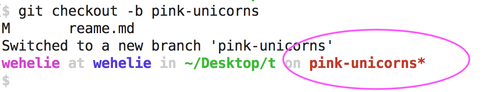

# How to Create a Github Repo

### Step 1

On my github account, I simply click on the `+` sign located on the top-right next to my avatar. Next, I select `New repository`




- - -

### Step 2
Next, on the `Create a new repository` page, I simply give my repo a name; I call it, `ad310-assingment9`. After this, you click on the green button that says, `create repository`.




- - - 

# How to push to a new Github Repo for the First Time

Now that I've created my repo, I need to populate or `push` data to it. There are many ways of doing this, but this best option is to use the command-line (of course, you must install git to your computer). To create the new repo using the command, I followed these steps:

```
echo "# ad310-assingment9" >> README.md
git init
git add README.md
git commit -m "first commit"
git remote add origin https://github.com/wehelie/ad310-assingment9.git
git push -u origin master
```

- - - 




My repo has been created and data has been `push` to it. Here is how it looks like:



 - - -


# How to Create a new branch

There are several ways to create branches in Github. The simpliest way is to use the command-line:

```
git checkout -b [the name of the new branch]
```

This creates a new branch in my local machine which I can push to my repo that is already existing.


